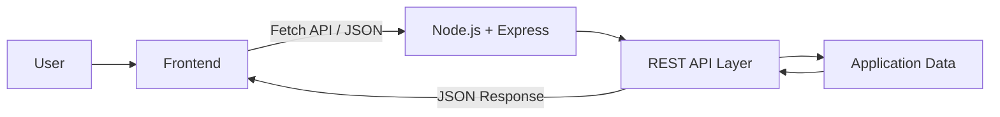

# MediCloud

> **Organize Your Health Records. Access Them with Ease.**  
> *Medical Records & Health Document Management System*  


---

## 1. Project Overview

MediCloud is a modern, responsive web application engineered to consolidate personal medical records, clinician visits, prescriptions, health documents, and diagnostic history in a unified interface.

Built following a decoupled client-server pattern, MediCloud demonstrates core cloud-native architecture principles without requiring external cloud databases or third-party storage APIs. The frontend interacts with a modular Node.js REST API layer using standard Fetch API and JSON exchanges.



---

## 2. Cloud Computing Relevance

> "MediCloud demonstrates cloud-ready client-server architecture through a decoupled frontend, Node.js REST backend and JSON-based API communication. The architecture can be deployed to cloud infrastructure when required."

### Key Cloud Concepts Demonstrated
- **Decoupled Architecture:** Strict separation between presentation assets and backend application services.
- **Stateless Communication:** Independent HTTP requests carrying self-contained payloads adhering to REST design.
- **Microservice-Ready Routing:** Individual domain route modules (`records`, `visits`, `prescriptions`, `documents`, `profile`, `dashboard`).
- **Cloud-Ready Deployment:** Environment port configurability (`process.env.PORT`) and no reliance on local operating system dependencies.

---

## 3. Technology Stack

- **Frontend:** HTML5, CSS3 (Modern Healthcare SaaS Design System), Vanilla JavaScript (ES6+), Fetch API
- **Backend:** Node.js, Express.js
- **Data Layer:** Application-level structured JavaScript data models with realistic seed information
- **Protocol:** HTTP REST APIs with JSON payloads

---

## 4. Key Features & Capabilities

1. **Dynamic Health Dashboard:** Real-time statistics aggregation for records, doctor visits, prescriptions, and cataloged health documents, alongside a chronological activity feed and upcoming follow-ups.
2. **Clinical Vitals & Live BMI Indicator:** Tracks patient height, weight, and blood pressure with live client and server BMI recalculation and clinical category badge (Underweight, Normal Weight, Overweight, Obese).
3. **Printable Emergency Medical ID Card:** Hospital-grade formatted printable emergency card with blood group, emergency contacts, known allergies, chronic conditions, and active daily medications.
4. **Prescription Adherence & Status Management:** Active vs. Completed medication tracking with 1-click status toggling and status-based filtering.
5. **Detailed Clinical Record "View Report":** Modal providing a structured summary report with doctor, diagnostic history, symptoms, observations, and one-click print utility.
6. **Cloud Architecture & Viva Guide Modal:** Built-in interactive viva preparation guide explaining stateless REST APIs, decoupling, and cloud-ready design principles.
7. **Appointment Countdowns:** Intelligent relative time computation showing "Due Today", "Tomorrow", or exact days remaining for upcoming clinician visits.
8. **Clinical Health Dossier & PDF Export:** One-click compilation of a complete, hospital-grade patient medical dossier into an official print-ready PDF report containing patient vitals, BMI classification, allergy alerts, active/completed prescriptions, doctor visits timeline, and cataloged diagnostic scans.
9. **Dark / Light SaaS Theme System:** Fully styled, accessible dark and light mode toggle with local storage persistence across sessions.
10. **Zero Hardcoded Data & Real-Time State:** Every metric is computed dynamically from active in-memory arrays, with "Clear All Data (0)" and "Restore Sample Data" actions to prove dynamic reactivity. Dynamic initials update live across all headers.
11. **Responsive Modal UX Architecture:** Pinned modal footer buttons, internal scroll containment (`overscroll-behavior: contain`), and background scroll lock (`overflow: hidden`).
12. **Medical Records Management:** Full CRUD operations for clinical consultations, routine checkups, diagnostic lab reports, and booster immunizations.
13. **Doctor Visits & Appointments:** Comprehensive clinician logs tracking doctors, specializations, clinics, visit reasons, notes, and scheduled follow-up dates.
14. **Health Documents Metadata Catalog:** Structured metadata manager indexing diagnostic reports, vaccination certificates, and clinical prescriptions.
15. **Global Search & Multi-Attribute Filters:** Instant search scanning all entities with multi-attribute filtering (by type, physician, date) and sorting.

---

## 5. API Reference

### Dashboard
- `GET /api/dashboard` — Aggregated counts, vitals, recent timeline events, and upcoming visits.
- `POST /api/dashboard/clear` — Clear all records, visits, prescriptions, and documents to demonstrate 0 state.
- `POST /api/dashboard/reset` — Restore sample clinical dataset.
- `GET /api/dashboard/export` — Download full JSON backup of health records and profile.

### Medical Records
- `GET /api/records` — List all records (supports `type`, `doctor`, `date`, `sortBy`, `search` query parameters)
- `GET /api/records/:id` — Retrieve a single medical record
- `POST /api/records` — Create a new medical record
- `PATCH /api/records/:id` — Update an existing medical record
- `DELETE /api/records/:id` — Delete a medical record

### Doctor Visits
- `GET /api/visits` — List all visits (supports `specialization`, `doctor`, `sortBy`, `search`)
- `GET /api/visits/:id` — Retrieve a specific visit
- `POST /api/visits` — Log a new visit
- `PATCH /api/visits/:id` — Update visit details
- `DELETE /api/visits/:id` — Delete visit entry

### Prescriptions
- `GET /api/prescriptions` — List all medications (supports `medicine`, `doctor`, `status`, `sortBy`, `search`)
- `GET /api/prescriptions/:id` — Retrieve single prescription
- `POST /api/prescriptions` — Add prescription
- `PATCH /api/prescriptions/:id` — Update prescription
- `PATCH /api/prescriptions/:id/toggle` — Toggle prescription status between `Active` and `Completed`
- `DELETE /api/prescriptions/:id` — Delete prescription

### Health Documents
- `GET /api/documents` — List document metadata (supports `type`, `sortBy`, `search`)
- `GET /api/documents/:id` — Retrieve document info
- `POST /api/documents` — Catalog document metadata
- `PATCH /api/documents/:id` — Update document metadata
- `DELETE /api/documents/:id` — Delete document record

### Health Profile
- `GET /api/profile` — Retrieve patient health profile
- `PATCH /api/profile` — Update patient medical profile

### Global Search
- `GET /api/search?q=...` — Cross-entity query across records, visits, prescriptions, and documents.

---

## 6. Algorithmic Complexity

- **Direct ID Lookup:** $O(n)$ worst-case scan across in-memory collections; $O(1)$ average when utilizing dictionary/key indexing.
- **Search & Filtering:** $O(n)$ linear scan filtering items matching normalized string queries.
- **Sorting:** $O(n \log n)$ leveraging JavaScript's Timsort implementation.
- **Dashboard Aggregation:** $O(n)$ single-pass aggregation across domain collections.

---

## 7. Setup & Run Instructions

### Prerequisites
- Node.js (v18.0.0 or higher)
- npm (v9.0.0 or higher)

### 1. Installation
Install project dependencies:
```bash
npm install
```

### 2. Run the Application
Start the Node.js Express server:
```bash
npm start
```
The server will start at:
```
http://localhost:3000
```

### 3. Run Automated Tests
Execute the test suite covering positive, negative, and edge validation scenarios:
```bash
npm test
```

---

## 8. Directory Structure

```
MediCloud/
├── package.json
├── .gitignore
├── server.js
├── README.md
├── data/
│   └── store.js
├── routes/
│   ├── dashboardRoutes.js
│   ├── recordRoutes.js
│   ├── visitRoutes.js
│   ├── prescriptionRoutes.js
│   ├── documentRoutes.js
│   ├── profileRoutes.js
│   └── searchRoutes.js
├── utils/
│   └── helpers.js
├── tests/
│   └── test-suite.js
└── public/
    ├── index.html
    ├── records.html
    ├── visits.html
    ├── prescriptions.html
    ├── documents.html
    ├── profile.html
    ├── css/
    │   └── style.css
    └── js/
        ├── api.js
        ├── dashboard.js
        ├── records.js
        ├── visits.js
        ├── prescriptions.js
        ├── documents.js
        └── profile.js
```

---

## 9. Future Scope

- Integration with cloud container registries (e.g., Docker containerization).
- OAuth 2.0 / OpenID Connect stateless authentication.
- Read-replica caching patterns for high-throughput healthcare query scenarios.
- Telemedicine video consultation link metadata integration.
